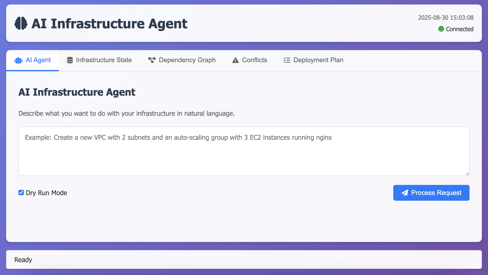
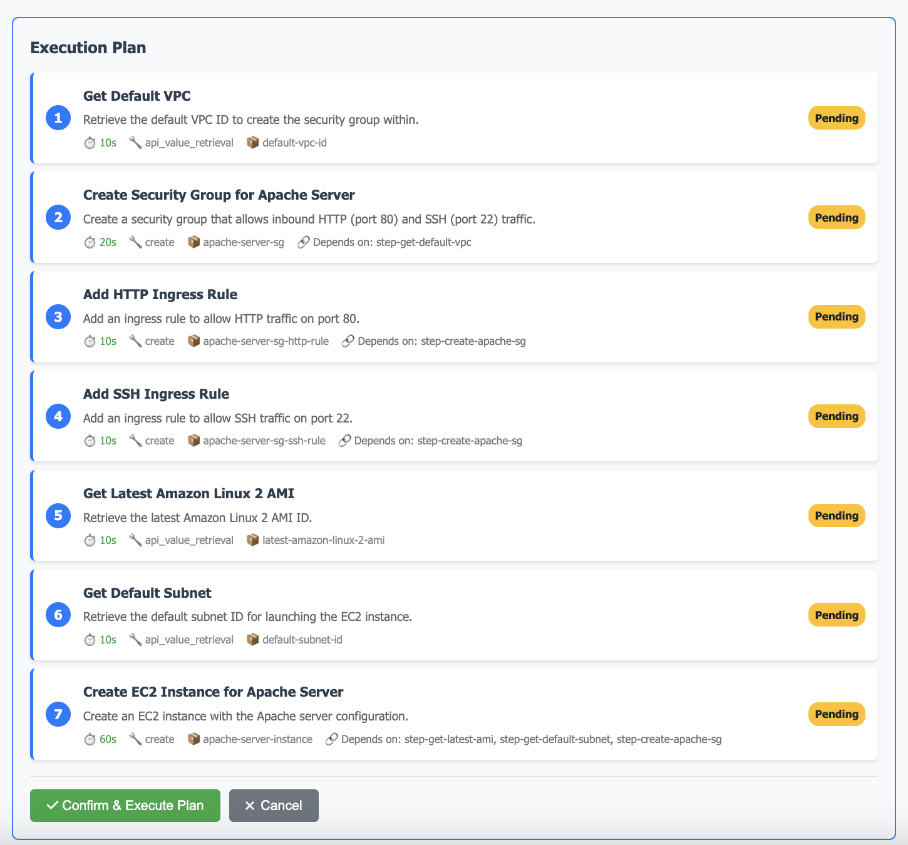
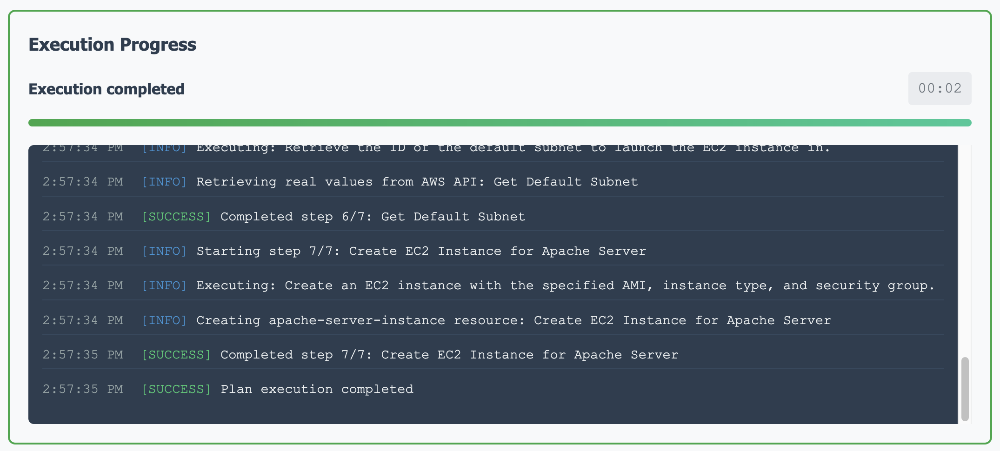
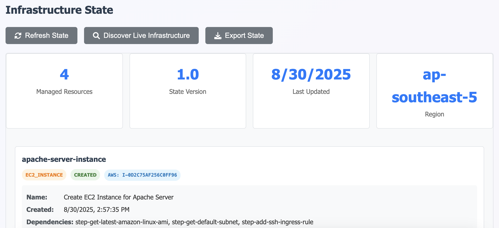

# AI Infrastructure Agent for AWS

Transform your AWS infrastructure management with natural language commands! This guide will walk you through everything you need to know to start using the AI Infrastructure Agent effectively.

Note: This is Proof of Concept Project.

## What You'll Learn

- How to set up and configure the AI Infrastructure Agent
- Step-by-step walkthrough of creating infrastructure with natural language
- Best practices for safe infrastructure management
- Advanced usage patterns and tips

## Prerequisites Checklist

Before diving in, make sure you have:

- ✅ **AWS Account** with appropriate IAM permissions
- ✅ **Go 1.24.2+** installed on your system
- ✅ **AI Provider API Key** (OpenAI, Gemini, or Anthropic)
- ✅ **Basic understanding** of AWS services (EC2, VPC, Security Groups)

## Step 1: Installation & Setup

### Quick Installation

```bash
# Clone the repository
git clone https://github.com/VersusControl/ai-infrastructure-agent.git
cd ai-infrastructure-agent

# Run the automated installation script
./scripts/install.sh
```

The installation script will handle everything for you:
- Install Go dependencies
- Build the applications
- Create necessary directories
- Set up configuration files

### Configure Your Environment

1. **Set up your AI provider API key:**

```bash
# For OpenAI (recommended for beginners)
export OPENAI_API_KEY="your-openai-api-key-here"

# For Google Gemini
export GEMINI_API_KEY="your-gemini-api-key-here"

# For Anthropic Claude
export ANTHROPIC_API_KEY="your-anthropic-api-key-here"
```

2. **Configure AWS credentials:**

```bash
# Method 1: Using AWS CLI (recommended)
aws configure

# Method 2: Environment variables
export AWS_ACCESS_KEY_ID="your-access-key"
export AWS_SECRET_ACCESS_KEY="your-secret-key"
export AWS_DEFAULT_REGION="us-west-2"
```

3. **Edit configuration file:**

```bash
nano config.yaml
```

Update the configuration to match your preferences:

```yaml
agent:
  provider: "openai"          # Your chosen AI provider
  model: "gpt-4"             # AI model to use
  dry_run: true              # Start with dry-run for safety
  auto_resolve_conflicts: false

aws:
  region: "us-west-2"        # Your preferred AWS region
  profile: "default"

web:
  port: 8080                 # Web dashboard port
```

---

## Step 2: Launch the Web Dashboard

Start the web interface:

```bash
./scripts/run-web-ui.sh
```

Open your browser and navigate to `http://localhost:8080`



The dashboard provides:
- **Natural language input** for infrastructure requests
- **Visual execution plans** before any changes
- **Real-time monitoring** of infrastructure operations
- **State management** and conflict detection

---

## Step 3: Your First Infrastructure Request

Let's create a simple web server infrastructure with a practical example.

### Example Request

In the web dashboard, enter this natural language request:

> **"Create an EC2 instance for hosting an Apache Server with a dedicated security group that allows inbound HTTP (port 80) and SSH (port 22) traffic."**

### What Happens Next

#### 1. AI Analysis & Planning



The AI agent will:
- Parse your natural language request
- Identify required AWS resources
- Generate a detailed execution plan
- Show dependencies between resources

**Review the plan carefully** and click **"Approve & Execute"** when ready.

#### 2. Execution & Monitoring



Watch as the agent:
- Executes steps in the correct order
- Handles dependencies automatically
- Provides real-time progress updates
- Reports any issues immediately

#### 3. Infrastructure State Tracking



The agent maintains a complete state of your infrastructure:
- **Resource inventory** with relationships
- **Change history** and audit trail
- **Cost tracking** and optimization suggestions
- **Drift detection** from expected configuration

## Step 4: Advanced Usage Patterns

Try more complex infrastructure requests:

```bash
# Load-balanced web application
"Deploy a load-balanced web application with 2 EC2 instances behind an ALB in different availability zones"

# Complete development environment  
"Set up a development environment with VPC, public and private subnets, NAT gateway, EC2 instances, and RDS MySQL database"

# Auto-scaling setup
"Create an auto-scaling group with 2-10 instances that scales based on CPU utilization above 70%"

# Secure environment
"Create a secure 3-tier architecture with web servers in public subnets, app servers in private subnets, and database in isolated subnets"
```

## Troubleshooting Common Issues

### Authentication Problems

**Issue**: AWS authentication fails
```bash
# Check AWS credentials
aws sts get-caller-identity

# Verify permissions
aws iam get-user

# Test basic access
aws ec2 describe-regions
```

**Issue**: AI provider API fails
```bash
# Check if API key is set
echo $OPENAI_API_KEY

# Test API connection
curl -H "Authorization: Bearer $OPENAI_API_KEY" https://api.openai.com/v1/models
```

### Port Conflicts

**Issue**: Web dashboard won't start
```bash
# Check what's using port 8080
lsof -i :8080

# Change port in config.yaml
web:
  port: 8081  # Use different port
```

### Resource Limits

**Issue**: AWS service limits reached
- Check AWS service quotas in AWS Console
- Request limit increases if needed
- Use different regions with available capacity

### Performance Issues

**Issue**: Slow AI responses
- Try a faster model (e.g., `gpt-3.5-turbo` instead of `gpt-4`)
- Reduce `max_tokens` in configuration
- Check your internet connection

## Tips for Success

### Start Small
- Begin with simple requests like single EC2 instances
- Gradually work up to complex multi-tier architectures
- Always use dry-run mode initially

### Be Specific
- Include details like instance types, regions, and configurations
- Specify security requirements clearly
- Mention any compliance or performance requirements

### Review Everything
- Always review execution plans before approval
- Check cost estimates against your budget
- Verify security group rules match your requirements

### Learn from History
- Review past executions in the dashboard
- Learn from the agent's decision-making process
- Build a library of successful request patterns

## Next Steps

Now that you're up and running:

1. **Experiment** with different types of infrastructure requests
2. **Join the community** discussions on GitHub
3. **Contribute** improvements and bug fixes
4. **Share** your successful patterns with others
5. **Stay updated** with new features and improvements

---

<div align="center">

**Happy Infrastructure Management! 🎉**

*Remember: This is a PoC project. Always test in development environments first.*

[⭐ Star the Repository](https://github.com/VersusControl/ai-infrastructure-agent) | [🐛 Report Issues](https://github.com/VersusControl/ai-infrastructure-agent/issues) | [💡 Request Features](https://github.com/VersusControl/ai-infrastructure-agent/issues)

</div>
